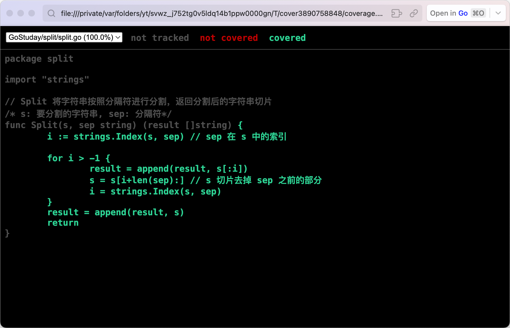
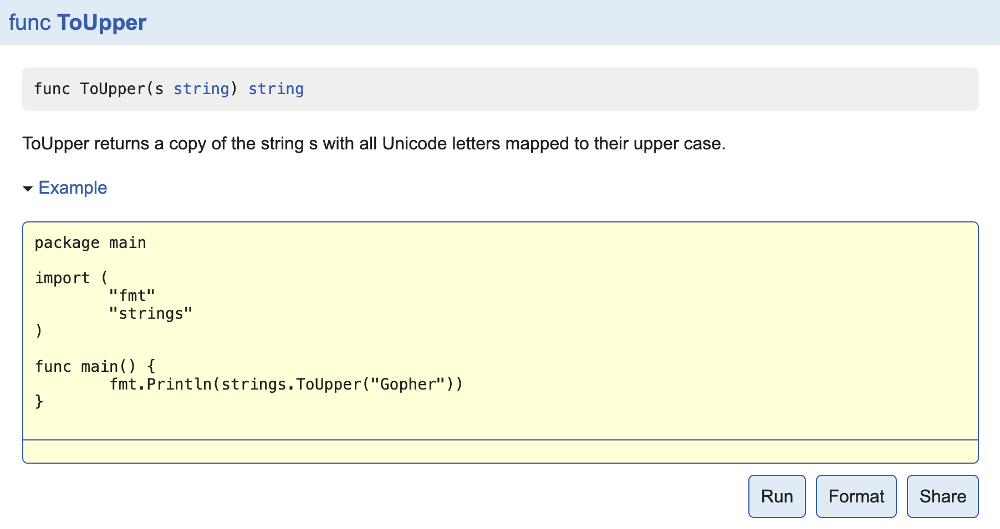

# Go Test

Go语言中的测试依赖`go test`命令。编写测试代码和编写普通的Go代码过程是类似的，并不需要学习新的语法、规则或工具。

go test命令是一个按照一定约定和组织的测试代码的驱动程序。在包目录内，所有以`_test.go`为后缀名的源代码文件都是`go test`测试的一部分，不会被`go build`编译到最终的可执行文件中。

在`*_test.go`文件中有三种类型的函数，单元测试函数、基准测试函数和示例函数。

| 类型   | 格式              | 作用              |
| ---- | --------------- | --------------- |
| 测试函数 | 函数名前缀为Test      | 测试程序的一些逻辑行为是否正确 |
| 基准函数 | 函数名前缀为Benchmark | 测试函数的性能         |
| 示例函数 | 函数名前缀为Example   | 为文档提供示例文档       |
`go test`命令会遍历所有的`*_test.go`文件中符合上述命名规则的函数，然后生成一个临时的main包用于调用相应的测试函数，然后构建并运行、报告测试结果，最后清理测试中生成的临时文件。

# 测试函数

## 格式

每个测试函数必须引入 `testing` 包，基本格式（签名）如下：

```go
func TestName(t *testing.T){
    // ...
}
```

测试函数的名字必须以`Test`开头，可选的后缀名必须以大写字母开头，举几个例子：

```go
func TestAdd(t *testing.T){ ... }
func TestSum(t *testing.T){ ... }
func TestLog(t *testing.T){ ... }
```

其中参数`t`用于报告测试失败和附加的日志信息。 `testing.T`的拥有的方法如下：

```go
func (c *T) Error(args ...interface{})
func (c *T) Errorf(format string, args ...interface{})
func (c *T) Fail()
func (c *T) FailNow()
func (c *T) Failed() bool
func (c *T) Fatal(args ...interface{})
func (c *T) Fatalf(format string, args ...interface{})
func (c *T) Log(args ...interface{})
func (c *T) Logf(format string, args ...interface{})
func (c *T) Name() string
func (t *T) Parallel()
func (t *T) Run(name string, f func(t *T)) bool
func (c *T) Skip(args ...interface{})
func (c *T) SkipNow()
func (c *T) Skipf(format string, args ...interface{})
func (c *T) Skipped() bool
```

## 示例

定义了一个 `split` 包，包中定义了一个 `Split` 函数（在 `split.go` 文件中），参数是一个 字符串 和 标识符，根据标识符来分割字符串：
```go
/* split.go */
package split  
  
import "strings"  
  
// Split 将字符串按照分隔符进行分割，返回分割后的字符串切片  
/* s: 要分割的字符串, sep: 分隔符*/  
func Split(s, sep string) (result []string) {  
    i := strings.Index(s, sep) // sep 在 s 中的索引  
  
    for i > -1 {  
       result = append(result, s[:i])  
       s = s[i+len(sep):] // s 切片去掉 sep 之前的部分  
       i = strings.Index(s, sep)  
    }  
    result = append(result, s)  
    return  
}
```

在包的目录下，创建一个 `split_test.go` 测试文件，编写测试函数 `TestSplit`:

```go
/* TestSplit */
package split  
  
import (  
    "reflect"  
    "testing")  
  
// 测试 Split 函数  
func TestSplit(t *testing.T) {  
    got := Split("a:b:c", ":")      // 调用 Split 函数,传入参数进行测试  
    want := []string{"a", "b", "c"} // 期望的结果  
    // 比较结果  
    if !reflect.DeepEqual(want, got) { // 因为slice不能比较直接，借助反射包中的方法比较  
       t.Errorf("expected:%v, got:%v", want, got) // 测试失败输出错误提示  
    }  
}
```

运行 `go test` ，得到以下输出：
```zsh
go test
PASS
ok  	GoStuday/split	0.685s
```

一个测试用例有点单薄，我们再编写一个测试使用多个字符切割字符串的例子，在`split_test.go`中添加如下测试函数：
```go
// 测试 Split 函数  
func TestMoreSplit(t *testing.T) {  
    got := Split("abcd", "bc")  
    want := []string{"a", "d"}  
    if !reflect.DeepEqual(want, got) {  
       t.Errorf("expected:%v, got:%v", want, got)  
    }  
}
```

再次运行 `go test` 命令：
``` zsh
go test
PASS
ok  	GoStuday/split	0.561s
```

可以为`go test`命令添加`-v`参数，查看测试函数名称和运行时间：
```zsh
go test -v
=== RUN   TestSplit
--- PASS: TestSplit (0.00s)
=== RUN   TestMoreSplit
--- PASS: TestMoreSplit (0.00s)
PASS
ok  	GoStuday/split	0.311s
```

还可以在`go test`命令后添加`-run`参数，它对应一个正则表达式，只有函数名匹配上的测试函数才会被`go test`命令执行。
```zsh
go test -v -run="More"
=== RUN   TestMoreSplit
--- PASS: TestMoreSplit (0.00s)
PASS
ok  	GoStuday/split	0.318s
```

## 测试组

如果想要再加一个测试用例，就要再写一个函数，那如果测试用例很多的情况下，这样的效率实在太低了。可以这样写，讲一组测试用例合到一个测试函数里：
```go
// 测试 Split 函数  
func TestSplit(t *testing.T) {  
    // 定义一个测试用例类型  
    type test struct {  
       input string  
       sep   string  
       want  []string  
    }  
    // 定义一个存储测试用例的切片  
    tests := []test{  
       {input: "a:b:c", sep: ":", want: []string{"a", "b", "c"}},  
       {input: "abcd", sep: "bc", want: []string{"ad"}},  
       {input: "沙河有沙又有河", sep: "沙", want: []string{"河有", "又有河"}},  
    }  
    // 遍历测试  
    for _, tc := range tests {  
       got := Split(tc.input, tc.sep)  
       // 比较结果  
       if !reflect.DeepEqual(got, tc.want) {  
          // 使用 %#v 格式化输出，解决输出中包含中文字符出现的空串的问题  
          t.Errorf("expected:%#v, got:%#v", tc.want, got)  
       }  
    }  
}
```

运行 `go test -v`:
```zsh
go test -v
=== RUN   TestSplit
    split_test.go:28: expected:[]string{"ad"}, got:[]string{"a", "d"}
    split_test.go:28: expected:[]string{"河有", "又有河"}, got:[]string{"", "河有", "又有河"}
--- FAIL: TestSplit (0.00s)
FAIL
exit status 1
FAIL	GoStuday/split	0.732s
```

## 子测试

如果测试用例比较多的时候，我们是没办法一眼看出来具体是哪个测试用例失败了。Go1.7+中新增了子测试，我们可以按照如下方式使用`t.Run`执行子测试：
```go
// 测试 Split 函数  
func TestSplit(t *testing.T) {  
    // 定义一个测试用例类型  
    type test struct {  
       input string  
       sep   string  
       want  []string  
    }  
    // 定义一个存储测试用例的切片  
    tests := map[string]test{ // 测试用例使用map存储  
       "simple":      {input: "a:b:c", sep: ":", want: []string{"a", "b", "c"}}, 
       "wrong sep":   {input: "a:b:c", sep: ",", want: []string{"a:b:c"}},  
       "more sep":    {input: "abcd", sep: "bc", want: []string{"a", "d"}},  
       "leading sep": {input: "沙河有沙又有河", sep: "沙", want: []string{"河有", "又有河"}},  
    }  
    // 遍历测试  
    for name, tc := range tests {  
       // 子测试  
       t.Run(name, func(t *testing.T) {  
          got := Split(tc.input, tc.sep)  
          // 比较结果  
          if !reflect.DeepEqual(got, tc.want) {  
             // 使用 %#v 格式化输出，解决输出中包含中文字符出现的空串的问题  
             t.Errorf("expected:%#v, got:%#v", tc.want, got)  
          }  
       })  
    }  
}
```

此时再执行`go test`命令就能够看到更清晰的输出内容了：
```zsh
go test -v
=== RUN   TestSplit
=== RUN   TestSplit/simple
=== RUN   TestSplit/wrong_sep
=== RUN   TestSplit/more_sep
=== RUN   TestSplit/leading_sep
    split_test.go:31: expected:[]string{"河有", "又有河"}, got:[]string{"", "河有", "又有河"}
--- FAIL: TestSplit (0.00s)
    --- PASS: TestSplit/simple (0.00s)
    --- PASS: TestSplit/wrong_sep (0.00s)
    --- PASS: TestSplit/more_sep (0.00s)
    --- FAIL: TestSplit/leading_sep (0.00s)
FAIL
exit status 1
FAIL	GoStuday/split	0.339s
```

更正测试：
```go
func TestSplit(t *testing.T) {
	...
	tests := map[string]test{ // 测试用例使用map存储
		"simple":      {input: "a:b:c", sep: ":", want: []string{"a", "b", "c"}},
		"wrong sep":   {input: "a:b:c", sep: ",", want: []string{"a:b:c"}},
		"more sep":    {input: "abcd", sep: "bc", want: []string{"a", "d"}},
		"leading sep": {input: "沙河有沙又有河", sep: "沙", want: []string{"", "河有", "又有河"}},
	}
	...
}
```

运行：
```zsh
go test -v
=== RUN   TestSplit
=== RUN   TestSplit/simple
=== RUN   TestSplit/wrong_sep
=== RUN   TestSplit/more_sep
=== RUN   TestSplit/leading_sep
--- PASS: TestSplit (0.00s)
    --- PASS: TestSplit/simple (0.00s)
    --- PASS: TestSplit/wrong_sep (0.00s)
    --- PASS: TestSplit/more_sep (0.00s)
    --- PASS: TestSplit/leading_sep (0.00s)
PASS
ok  	GoStuday/split	0.210s
```


可以通过`-run=RegExp`来指定运行的测试用例，还可以通过`/`来指定要运行的子测试用例，例如：`go test -v -run=Split/simple`只会运行`simple`对应的子测试用例。

## 测试覆盖率

测试覆盖率是你的代码被测试套件覆盖的百分比。通常我们使用的都是语句的覆盖率，也就是在测试中至少被运行一次的代码占总代码的比例。

Go提供内置功能来检查你的代码覆盖率。我们可以使用`go test -cover`来查看测试覆盖率。例如：
```zsh
go test -cover
PASS
coverage: 100.0% of statements
ok  	GoStuday/split	0.344s
```

从上面的结果可以看到我们的测试用例覆盖了100%的代码。

Go还提供了一个额外的`-coverprofile`参数，用来将覆盖率相关的记录信息输出到一个文件。例如：
```bash
go test -cover -coverprofile=c.out
PASS
coverage: 100.0% of statements
ok  	GoStuday/split	0.373s
```

上面的命令会将覆盖率相关的信息输出到当前文件夹下面的`c.out`文件中，然后我们执行`go tool cover -html=c.out`，使用`cover`工具来处理生成的记录信息，该命令会打开本地的浏览器窗口生成一个HTML报告。



上图中每个用绿色标记的语句块表示被覆盖了，而红色的表示没有被覆盖。
# 基准测试

## 格式

基准测试就是在**一定的工作负载**之下**检测程序性能**的一种方法。基准测试的基本格式如下：

```go
func BenchmarkName(b *testing.B){
    // ...
}
```

基准测试以`Benchmark`为前缀，需要一个`*testing.B`类型的参数b，基准测试必须要执行`b.N`次，这样的测试才有对照性，`b.N`的值是系统根据实际情况去调整的，从而保证测试的稳定性。 `testing.B`拥有的方法如下：

```go
func (c *B) Error(args ...interface{})
func (c *B) Errorf(format string, args ...interface{})
func (c *B) Fail()
func (c *B) FailNow()
func (c *B) Failed() bool
func (c *B) Fatal(args ...interface{})
func (c *B) Fatalf(format string, args ...interface{})
func (c *B) Log(args ...interface{})
func (c *B) Logf(format string, args ...interface{})
func (c *B) Name() string
func (b *B) ReportAllocs()
func (b *B) ResetTimer()
func (b *B) Run(name string, f func(b *B)) bool
func (b *B) RunParallel(body func(*PB))
func (b *B) SetBytes(n int64)
func (b *B) SetParallelism(p int)
func (c *B) Skip(args ...interface{})
func (c *B) SkipNow()
func (c *B) Skipf(format string, args ...interface{})
func (c *B) Skipped() bool
func (b *B) StartTimer()
func (b *B) StopTimer()
```

## 示例

我们为split包中的`Split`函数编写基准测试如下：
```go
func BenchmarkSplit(b *testing.B) {
	for i := 0; i < b.N; i++ {
		Split("沙河有沙又有河", "沙")
	}
}
```

*基准测试并不会默认执行*，需要增加`-bench`参数，所以我们通过执行`go test -bench=Split`命令执行基准测试，输出结果如下：
```zsh
go test -bench=Split
goos: darwin
goarch: arm64
pkg: GoStuday/split
BenchmarkSplit-8   	 9451810	       107.2 ns/op
PASS
ok  	GoStuday/split	1.542s
```

其中`BenchmarkSplit-8`表示对Split函数进行基准测试，数字`8`表示`GOMAXPROCS`的值，这个对于并发基准测试很重要。`9451810`和`107.2 ns/op`表示每次调用`Split`函数耗时`107.2ns`，这个结果是`9451810`次调用的平均值。

我们还可以为基准测试添加`-benchmem`参数，来获得内存分配的统计数据。
```zsh
go test -bench=Split -benchmem
goos: darwin
goarch: arm64
pkg: GoStuday/split
BenchmarkSplit-8   	11162394	       107.5 ns/op	     112 B/op	       3 allocs/op
PASS
ok  	GoStuday/split	2.535s
```

其中，`112 B/op`表示每次操作内存分配了 `112` 字节，`3 allocs/op`则表示每次操作进行了 `3` 次内存分配。 我们将我们的`Split`函数优化如下：
```go
func Split(s, sep string) (result []string) {  
    result = make([]string, 0, strings.Count(s, sep)+1)  
    i := strings.Index(s, sep)  
    for i > -1 {  
       result = append(result, s[:i])  
       s = s[i+len(sep):] // 这里使用len(sep)获取sep的长度  
       i = strings.Index(s, sep)  
    }  
    result = append(result, s)  
    return  
}
```

这一次我们提前使用make函数将result初始化为一个容量足够大的切片，而不再像之前一样通过调用append函数来追加。我们来看一下这个改进会带来多大的性能提升：
```zsh
go test -bench=Split -benchmem
goos: darwin
goarch: arm64
pkg: GoStuday/split
BenchmarkSplit-8   	13214583	        90.51 ns/op	      48 B/op	       1 allocs/op
PASS
ok  	GoStuday/split	2.649s
```

这个使用make函数提前分配内存的改动，减少了2/3的内存分配次数，并且减少了一半的内存分配。

## 性能比较函数

上面的基准测试只能得到*给定操作的绝对耗时*，但是在很多性能问题是发生**在两个不同操作之间的相对耗时**，比如同一个函数处理1000个元素的耗时与处理1万甚至100万个元素的耗时的差别是多少？再或者对于同一个任务究竟使用哪种算法性能最佳？我们通常需要对两个不同算法的实现使用相同的输入来进行基准比较测试。

性能比较函数通常是一个带有参数的函数，被多个不同的Benchmark函数传入不同的值来调用。举个例子如下：
```go
func benchmark(b *testing.B, size int){/* ... */}
func Benchmark10(b *testing.B){ benchmark(b, 10) }
func Benchmark100(b *testing.B){ benchmark(b, 100) }
func Benchmark1000(b *testing.B){ benchmark(b, 1000) }
```

例如我们编写了一个计算斐波那契数列的函数如下：
```go
// Fid 计算斐波那契数列的第n项  
func Fid(n int) int {  
    if n < 2 {  
       return n  
    }  
    return Fid(n-1) + Fid(n-2)  
}
```

我们编写的性能比较函数如下：
```go
func benchmarkFid(b *testing.B, n int) {  
    for i := 0; i < b.N; i++ {  
       Fid(n)  
    }  
}  
  
func BenchmarkFid1(b *testing.B) {  
    benchmarkFid(b, 1)  
}  
func BenchmarkFid2(b *testing.B) {  
    benchmarkFid(b, 2)  
}  
func BenchmarkFid3(b *testing.B) {  
    benchmarkFid(b, 3)  
}  
func BenchmarkFid10(b *testing.B) {  
    benchmarkFid(b, 10)  
}  
func BenchmarkFid20(b *testing.B) {  
    benchmarkFid(b, 20)  
}  
func BenchmarkFid40(b *testing.B) {  
    benchmarkFid(b, 40)  
}
```

运行基准测试：
```go
go test -bench=.
goos: darwin
goarch: arm64
pkg: GoStuday/fid
BenchmarkFid1-8    	510356426	         2.043 ns/op
BenchmarkFid2-8    	318472534	         3.767 ns/op
BenchmarkFid3-8    	224863113	         5.335 ns/op
BenchmarkFid10-8   	 6592486	       181.6 ns/op
BenchmarkFid20-8   	   53487	     22475 ns/op
BenchmarkFid40-8   	       3	 341606403 ns/op
PASS
ok  	GoStuday/fid	9.885s
```

这里需要注意的是，默认情况下，每个基准测试至少运行1秒。如果在Benchmark函数返回时没有到1秒，则b.N的值会按1,2,5,10,20,50，…增加，并且函数再次运行。

最终的BenchmarkFib40只运行了3次，每次运行的平均值只有不到一秒。像这种情况下我们应该可以使用`-benchtime`标志增加最小基准时间，以产生更准确的结果。例如：
```zsh
go test -bench=Fid40 -benchtime=20s
goos: darwin
goarch: arm64
pkg: GoStuday/fid
BenchmarkFid40-8   	      64	 341927036 ns/op
PASS
ok  	GoStuday/fid	22.452s
```

这一次`BenchmarkFib40`函数运行了64次，结果就会更准确一些了。

使用性能比较函数做测试的时候一个容易犯的错误就是把`b.N`作为输入的大小，例如以下两个例子都是错误的示范：
```go
// 错误示范1
func BenchmarkFibWrong(b *testing.B) {
	for n := 0; n < b.N; n++ {
		Fib(n)
	}
}

// 错误示范2
func BenchmarkFibWrong2(b *testing.B) {
	Fib(b.N)
}

```

## 重置时间

`b.ResetTimer`之前的处理不会放到执行时间里，也不会输出到报告中，所以可以在之前做一些不计划作为测试报告的操作。例如：
```go
func BenchmarkSplit(b *testing.B) {
	time.Sleep(5 * time.Second) // 假设需要做一些耗时的无关操作
	b.ResetTimer()              // 重置计时器
	for i := 0; i < b.N; i++ {
		Split("沙河有沙又有河", "沙")
	}
}
```

## 并行测试

`func (b *B) RunParallel(body func(*PB))`会以并行的方式执行给定的基准测试。

`RunParallel`会创建出多个`goroutine`，并将`b.N`分配给这些`goroutine`执行， 其中`goroutine`数量的默认值为`GOMAXPROCS`。用户如果想要增加非CPU受限（non-CPU-bound）基准测试的并行性， 那么可以在`RunParallel`之前调用`SetParallelism` 。`RunParallel`通常会与`-cpu`标志一同使用。
```go
func BenchmarkSplitParallel(b *testing.B) {
	// b.SetParallelism(1) // 设置使用的CPU数
	b.RunParallel(func(pb *testing.PB) {
		for pb.Next() {
			Split("沙河有沙又有河", "沙")
		}
	})
}
```

执行一下基准测试：
```zsh
go test -bench=.
goos: darwin
goarch: arm64
pkg: GoStuday/split
BenchmarkSplit-8           	12825044	        93.24 ns/op
BenchmarkSplitParallel-8   	43683884	        25.80 ns/op
PASS
ok  	GoStuday/split	3.770s
```

还可以通过在测试命令后添加`-cpu`参数如`go test -bench=. -cpu 1`来指定使用的CPU数量。
# Setup与TearDown

测试程序有时需要在测试之前进行额外的**设置（setup）** 或在测试之后进行**拆卸（teardown）**。

## TestMain

通过在`*_test.go`文件中定义`TestMain`函数来可以在测试之前进行额外的设置（setup）或在测试之后进行拆卸（teardown）操作。

如果测试文件包含函数:`func TestMain(m *testing.M)`那么生成的测试会先调用 TestMain(m)，然后再运行具体测试。`TestMain`运行在主`goroutine`中, 可以在调用 `m.Run`前后做任何设置（setup）和拆卸（teardown）。退出测试的时候应该使用`m.Run`的返回值作为参数调用`os.Exit`。

一个使用`TestMain`来设置Setup和TearDown的示例如下：
```go
func TestMain(m *testing.M) {  
    fmt.Println("write setup code here...") // 测试之前的做一些设置  
    // 如果 TestMain 使用了 flags，这里应该加上flag.Parse()  
    retCode := m.Run()                         // 执行测试  
    fmt.Println("write teardown code here...") // 测试之后做一些拆卸工作  
    os.Exit(retCode)                           // 退出测试  
}
```

需要注意的是：在调用`TestMain`时, `flag.Parse`并没有被调用。所以如果`TestMain` 依赖于command-line标志 (包括 testing 包的标记), 则应该显示的调用`flag.Parse`。

## 子测试的Setup与Teardown

有时候我们可能需要为每个测试集设置Setup与Teardown，也有可能需要为每个子测试设置Setup与Teardown。下面我们定义两个函数工具函数如下：
```go
// 测试集的Setup与Teardown  
func setupTestCase(t *testing.T) func(t *testing.T) {  
    t.Log("如有需要在此执行:测试之前的setup")  
    return func(t *testing.T) {  
       t.Log("如有需要在此执行:测试之后的teardown")  
    }  
}  
  
// 子测试的Setup与Teardown  
func setupSubTest(t *testing.T) func(t *testing.T) {  
    t.Log("如有需要在此执行:子测试之前的setup")  
    return func(t *testing.T) {  
       t.Log("如有需要在此执行:子测试之后的teardown")  
    }  
}
```

使用：
```go
func TestSplit(t *testing.T) {  
    // 定义一个测试用例类型  
    type test struct {  
       input string  
       sep   string  
       want  []string  
    }  
    // 定义一个存储测试用例的切片  
    tests := map[string]test{ // 测试用例使用map存储  
       "simple":      {input: "a:b:c", sep: ":", want: []string{"a", "b", "c"}},  
       "wrong sep":   {input: "a:b:c", sep: ",", want: []string{"a:b:c"}},  
       "more sep":    {input: "abcd", sep: "bc", want: []string{"a", "d"}},  
       "leading sep": {input: "沙河有沙又有河", sep: "沙", want: []string{"", "河有", "又有河"}},  
    }  
    teardownTestCase := setupTestCase(t) // 测试之前执行setup操作  
    defer teardownTestCase(t)            // 测试之后执行teardown操作  
    // 遍历测试  
    for name, tc := range tests {  
       // 使用t.Run()执行子测试  
       t.Run(name, func(t *testing.T) {  
          teardownSubTest := setupSubTest(t) // 子测试之前执行setup操作  
          defer teardownSubTest(t)          // 子测试之后执行teardown操作  
          got := Split(tc.input, tc.sep) // 调用 Split 函数  
          if !reflect.DeepEqual(got, tc.want) {// 调用 Split 函数  
             // 使用 %#v 格式化输出，解决输出中包含中文字符出现的空串的问题  
             t.Errorf("expected:%#v, got:%#v", tc.want, got)  
          }  
       })  
    }  
}
```

测试结果：
```zsh
go test -v
write setup code here...
=== RUN   TestSplit
    split_test.go:20: 如有需要在此执行:测试之前的setup
=== RUN   TestSplit/simple
    split_test.go:28: 如有需要在此执行:子测试之前的setup
    split_test.go:30: 如有需要在此执行:子测试之后的teardown
=== RUN   TestSplit/wrong_sep
    split_test.go:28: 如有需要在此执行:子测试之前的setup
    split_test.go:30: 如有需要在此执行:子测试之后的teardown
=== RUN   TestSplit/more_sep
    split_test.go:28: 如有需要在此执行:子测试之前的setup
    split_test.go:30: 如有需要在此执行:子测试之后的teardown
=== RUN   TestSplit/leading_sep
    split_test.go:28: 如有需要在此执行:子测试之前的setup
    split_test.go:30: 如有需要在此执行:子测试之后的teardown
=== NAME  TestSplit
    split_test.go:22: 如有需要在此执行:测试之后的teardown
--- PASS: TestSplit (0.00s)
    --- PASS: TestSplit/simple (0.00s)
    --- PASS: TestSplit/wrong_sep (0.00s)
    --- PASS: TestSplit/more_sep (0.00s)
    --- PASS: TestSplit/leading_sep (0.00s)
PASS
write teardown code here...
ok  	GoStuday/split	0.424s
```


# 示例函数
## 格式

被`go test`特殊对待的第三种函数就是示例函数，它们的函数名以`Example`为前缀。它们既没有参数也没有返回值。标准格式如下：
```go
func ExampleName() {
    // ...
}
```

## 示例

下面的代码是我们为`Split`函数编写的一个示例函数：

```go
func ExampleSplit() {
	fmt.Println(split.Split("a:b:c", ":"))
	fmt.Println(split.Split("沙河有沙又有河", "沙"))
	// Output:
	// [a b c]
	// [ 河有 又有河]
}
```

为你的代码编写示例代码有如下三个用处：

1. 示例函数能够作为文档直接使用，例如基于web的godoc中能把示例函数与对应的函数或包相关联。
2. 示例函数只要包含了`// Output:`也是可以通过`go test`运行的可执行测试。
   
	```zsh
	go test -run Example
	PASS
	ok  	GoStuday/split	0.006s
	```

3. 示例函数提供了可以直接运行的示例代码，可以直接在`golang.org`的`godoc`文档服务器上使用`Go Playground`运行示例代码。下图为`strings.ToUpper`函数在Playground的示例函数效果。





